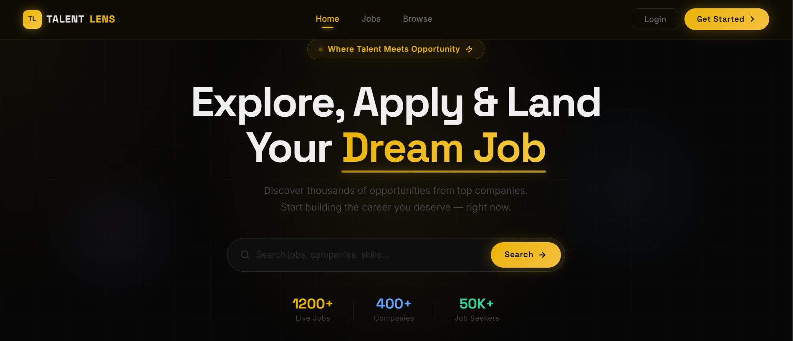
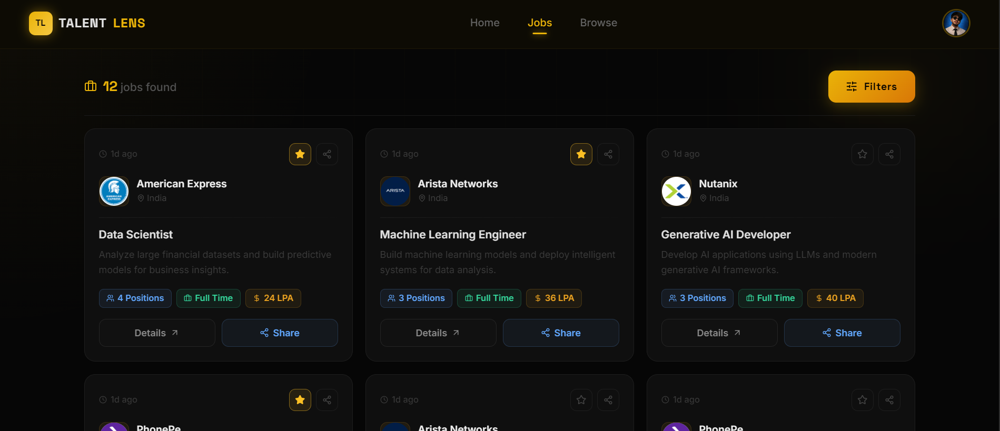
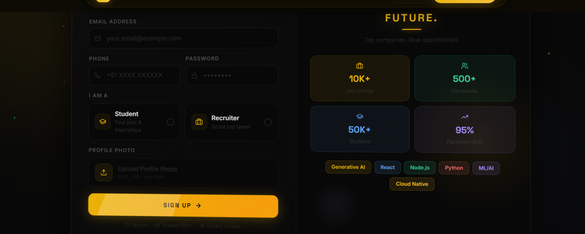
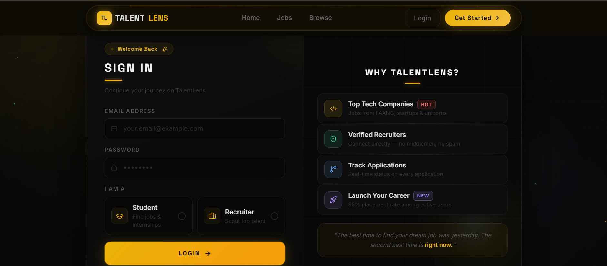
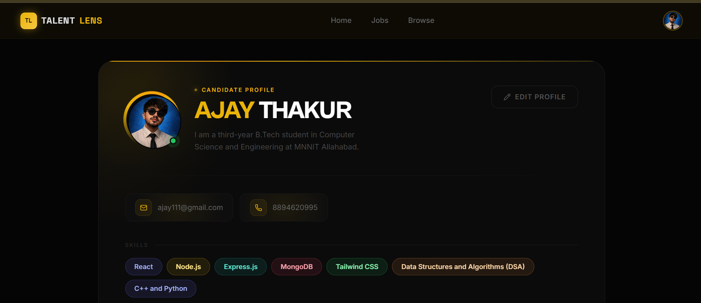
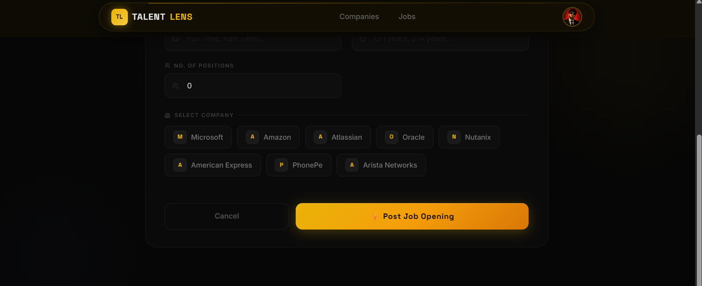
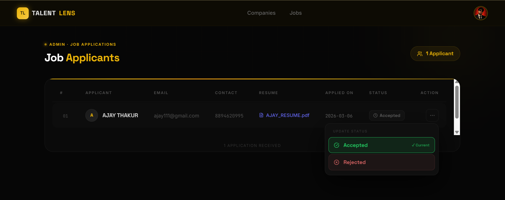
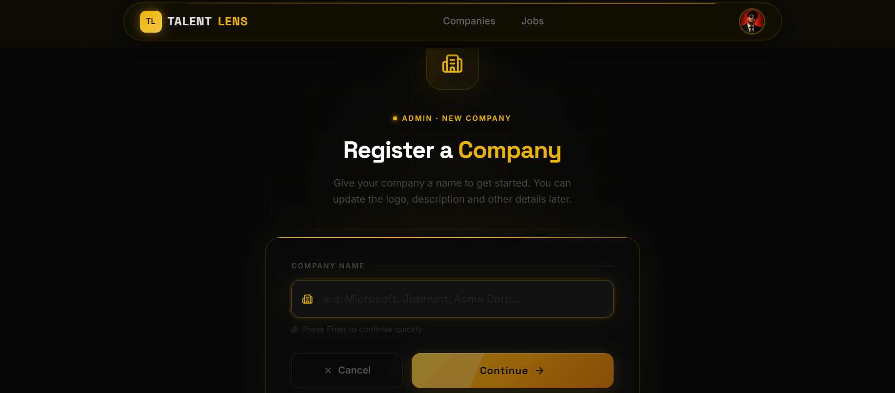

<div align="center">


<br/>

[](https://git.io/typing-svg)

<br/>


<br/>

[](https://github.com/YOUR_USERNAME/TalentLens)
[](https://github.com/YOUR_USERNAME/TalentLens/fork)
[](https://github.com/YOUR_USERNAME/TalentLens/issues)

</div>

---

## 📌 Overview

**TalentLens** is a full-stack **MERN job portal** platform that enables candidates to discover and apply for opportunities while helping recruiters publish openings, manage applications, and streamline the entire hiring process.

The platform provides secure authentication, resume uploads, company management, and an admin dashboard for recruiters.

---

## 📸A few screenshots of the website interface

| Home Page | Jobs Page |
|:---------:|:---------:|
|  |  |

| Login | Signup |
|:-----:|:------:|
|  |  |

| Profile | Create Job |
|:-------:|:----------:|
|  |  |

| Applicants Dashboard | Company Registration |
|:--------------------:|:--------------------:|
|  |  |

---

## ✨ Features

<details>
<summary><b>👤 Candidate Features</b></summary>
<br/>

- 🔐 Secure signup & login via JWT
- 🔍 Browse and search jobs by keyword / category
- 📄 Apply with resume upload (PDF → Cloudinary)
- 📊 Track all applied jobs and their statuses
- 🙍 Manage full profile — bio, skills, contact, resume

</details>

<details>
<summary><b>🏢 Recruiter Features</b></summary>
<br/>

- 🏭 Create and manage company profiles with logo
- 📝 Post new job openings with full details
- 👥 View all applicants per job
- ✅ Accept or ❌ Reject applicants — updates instantly
- 🗂 Admin dashboard to manage all listings

</details>

<details>
<summary><b>⚙️ Platform Features</b></summary>
<br/>

- 🔑 JWT auth with HTTP-only cookies
- 🔒 Passwords hashed with bcrypt
- ☁️ File uploads via Multer + Cloudinary
- ⚡ Global state with Redux Toolkit
- 🎞️ Smooth animations via Framer Motion
- 📱 Fully responsive UI

</details>

---

## 🛠 Tech Stack

<div align="center">

| Layer | Technologies |
|:------|:------------|
| **Frontend** | React, Vite, Redux Toolkit, React Router, Tailwind CSS, Framer Motion, Axios, Lucide Icons |
| **Backend** | Node.js, Express.js, MongoDB, Mongoose, JWT, bcrypt.js |
| **Storage** | Multer, Cloudinary |

</div>

---

## 📁 Project Structure

```
TalentLens/
│
├── 📦 backend/
│   ├── controllers/            # Route logic
│   ├── models/                 # Mongoose schemas
│   ├── routes/                 # Express routers
│   ├── middleware/             # Auth guard, Multer config
│   └── utils/                  # DB connect, Cloudinary config
│
├── 📦 frontend/
│   └── src/
│       ├── components/         # UI components (Navbar, Footer, Cards...)
│       │   ├── shared/         # Common across pages
│       │   ├── ui/             # Reusable primitives
│       │   └── admin/          # Recruiter-side views
│       ├── hooks/              # Custom React hooks
│       ├── redux/              # Store + slices (auth, job, application, company)
│       ├── utils/              # Constants, API endpoints
│       └── main.jsx
│
└── 📸 Screenshots/
```

---

## ⚙️ Getting Started

### 1. Clone the repository

```bash
git clone https://github.com/Ajaythakur000/TalentLens.git
cd TalentLens
```

### 2. Backend Setup

```bash
cd backend
npm install
```

Create `.env` inside `backend/`:

```env
PORT=5000
MONGO_URI=your_mongodb_connection_string

JWT_SECRET=your_secret_key
JWT_EXPIRY=7d

CLOUDINARY_CLOUD_NAME=your_cloud_name
CLOUDINARY_API_KEY=your_api_key
CLOUDINARY_API_SECRET=your_api_secret
```

```bash
npm run dev     # Runs on http://localhost:5000
```

### 3. Frontend Setup

```bash
cd ../frontend
npm install
```

Create `.env` inside `frontend/`:

```env
VITE_API_BASE_URL=http://localhost:5000/api/v1
```

```bash
npm run dev     # Runs on http://localhost:5173
```

---

## 🔌 API Reference

<details>
<summary><b>User — <code>/api/v1/user</code></b></summary>

| Method | Endpoint | Auth | Description |
|--------|----------|:----:|-------------|
| POST | `/register` | ❌ | Register new user |
| POST | `/login` | ❌ | Login & get JWT cookie |
| GET | `/logout` | ✅ | Logout user |
| PUT | `/profile/update` | ✅ | Update profile |

</details>

<details>
<summary><b>Company — <code>/api/v1/company</code></b></summary>

| Method | Endpoint | Auth | Description |
|--------|----------|:----:|-------------|
| POST | `/register` | ✅ | Register company |
| GET | `/get` | ✅ | Get all my companies |
| GET | `/get/:id` | ✅ | Get company by ID |
| PUT | `/update/:id` | ✅ | Update company info |

</details>

<details>
<summary><b>Jobs — <code>/api/v1/job</code></b></summary>

| Method | Endpoint | Auth | Description |
|--------|----------|:----:|-------------|
| POST | `/post` | ✅ | Post new job |
| GET | `/get` | ✅ | Get all jobs (with filters) |
| GET | `/getadminjobs` | ✅ | Recruiter's own jobs |
| GET | `/get/:id` | ✅ | Get job by ID |

</details>

<details>
<summary><b>Applications — <code>/api/v1/application</code></b></summary>

| Method | Endpoint | Auth | Description |
|--------|----------|:----:|-------------|
| GET | `/apply/:id` | ✅ | Apply to a job |
| GET | `/get` | ✅ | Get my applications |
| GET | `/:id/applicants` | ✅ | All applicants for job |
| POST | `/status/:id/update` | ✅ | Update application status |

</details>

---

## 🗺 Implemented

- [x] Secure authentication with JWT & role-based access
- [x] Candidate & recruiter workflows
- [x] Job listing, browsing and search functionality
- [x] Job application system for candidates
- [x] Recruiter dashboard for managing jobs
- [x] Applicant management with status updates
- [x] Resume and company logo uploads via Cloudinary
- [x] Protected routes and authorization middleware
- [x] Responsive UI with modern React + Tailwind layout

### 🚧 Upcoming Enhancements

- [ ] AI-powered job recommendations
- [ ] Resume parser for automatic candidate profiling
- [ ] Email notifications for application updates
- [ ] Real-time recruiter–candidate chat (Socket.io)
- [ ] Mobile application

---

## 👨‍💻 Author

<div align="center">

**AJAY THAKUR**
*CSE Student · MNNIT Allahabad*

<br/>

[](https://github.com/Ajaythakur000)
[](https://linkedin.com/in/ajayy-thakkurr)

</div>

---

## 📄 License

Distributed under the **MIT License**. See `LICENSE` for details.

---

<div align="center">


*If TalentLens helped you, drop a ⭐ on GitHub — it means a lot!*

</div>
